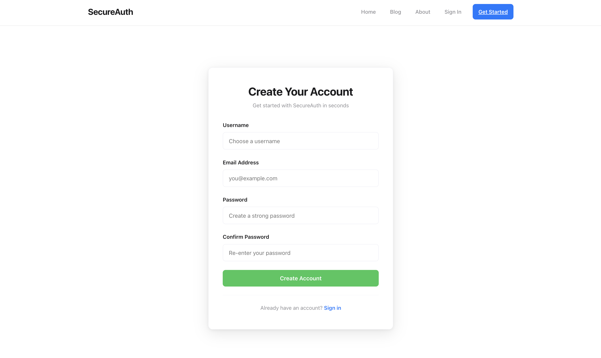
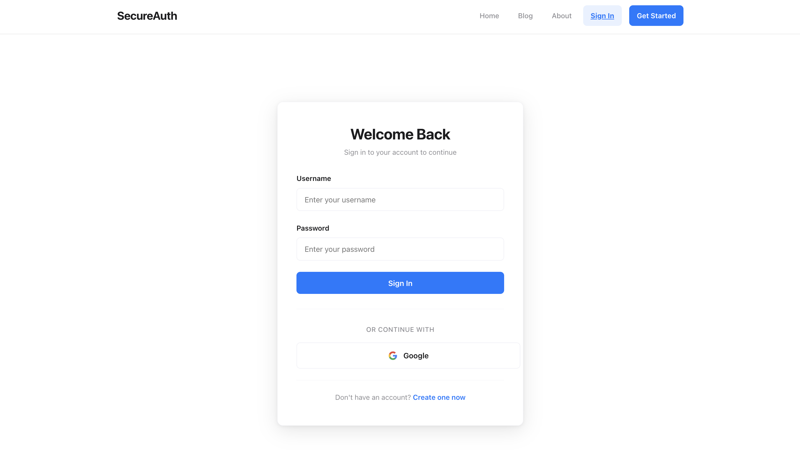
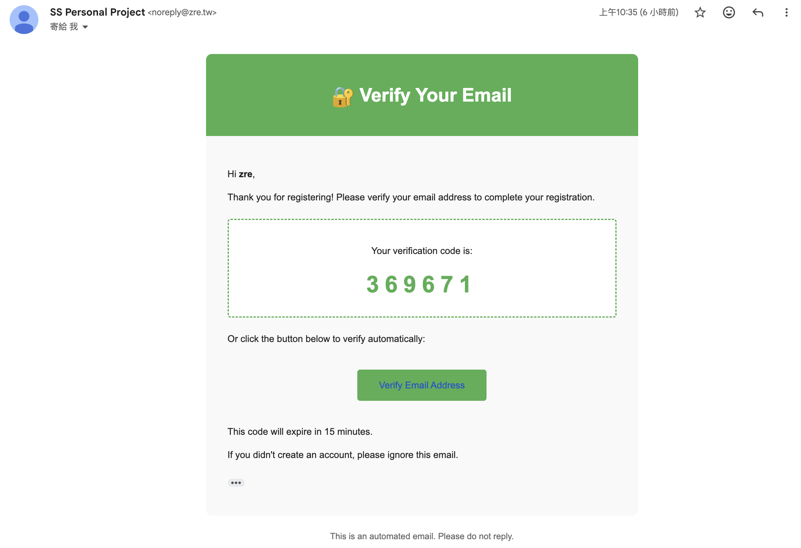
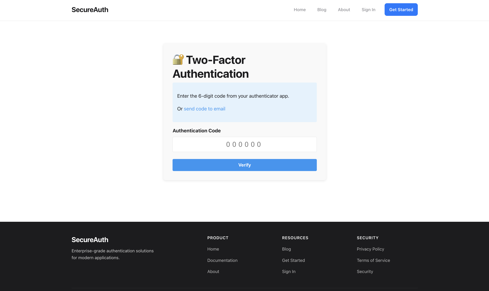
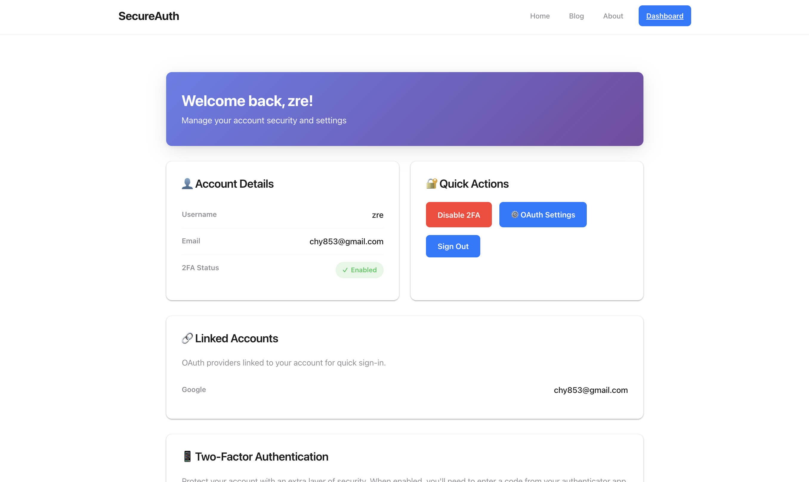
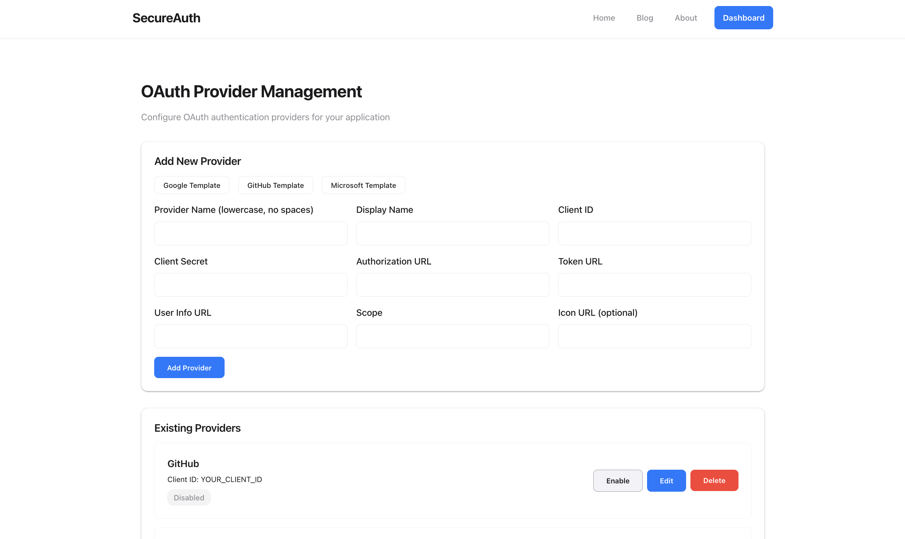

# Secure Login & User Authentication System
## Personal Project Report

**Student Name:** 張睿恩  
**Student ID:** 111590028  
**Course:** Software Security and Reverse Engineering  
**Live Demo:** https://ss.zre.tw/  
**GitHub Repository:** https://github.com/HeavenManySugar/ss-personal-project

---

## 1. Introduction

This project implements a secure user authentication system deployed on Cloudflare Workers, demonstrating modern security practices against common web vulnerabilities including SQL Injection, XSS, CSRF, and brute-force attacks.

**Key Features:** User registration with email verification • Secure login with account lockout • Multi-Factor Authentication (TOTP & Email) • OAuth integration (Google, GitHub) • Session management with CSRF protection • Admin panel

**Technology Stack:** Astro 5.16 (SSR) • Cloudflare Workers • D1 Database (SQLite) • PBKDF2-SHA256 (100K iterations) • TOTP (RFC 6238) • OAuth 2.0 (RFC 6749) • Resend API

### System Screenshots

<p align="center">


<br><sub>Figure 1: User Registration and Login Interface</sub>
</p>

<p align="center">


<br><sub>Figure 2: Email Verification and MFA Setup</sub>
</p>

---

## 2. Security Implementation

### 2.1 Password Security - PBKDF2 Hashing

```typescript
export async function hashPassword(password: string, salt: string): Promise<string> {
  const keyMaterial = await crypto.subtle.importKey('raw', encoder.encode(password), 'PBKDF2', false, ['deriveBits']);
  const derivedBits = await crypto.subtle.deriveBits(
    { name: 'PBKDF2', salt: hexToBytes(salt), iterations: 100000, hash: 'SHA-256' }, keyMaterial, 256
  );
  return bytesToHex(derivedBits);
}
```
**Security:** 100,000 iterations (OWASP standard) • Unique 16-byte salt per user • 256-bit output • ~100ms per hash (brute-force resistant)

### 2.2 Multi-Factor Authentication

**TOTP (RFC 6238):** HMAC-SHA1 • 30-second time step • 6-digit codes • ±30s clock drift tolerance • Google Authenticator compatible

**Email MFA:** 6-digit codes • 5-minute expiration • Single-use tokens • Rate limiting

### 2.3 SQL Injection Prevention

```typescript
// ✅ SECURE - Parameterized query
const user = await db.prepare(`SELECT * FROM users WHERE username = ?`).bind(username).first<User>();
```
**Result:** All queries use prepared statements - 0 vulnerabilities found in testing.

### 2.4 XSS Prevention

**Protection Layers:** Input sanitization (remove HTML tags) • Output escaping (Astro auto-escape) • Content Security Policy (CSP) headers • HttpOnly cookies (prevent JS access)

### 2.5 CSRF Prevention

**Mechanisms:** Unique CSRF token per session • Token validation on state-changing requests • `SameSite=Strict` cookies • OAuth state parameter (256-bit random)

### 2.6 Session & Rate Limiting

**Session Security:** UUID v4 IDs (128-bit) • 24-hour expiration • Flags: `HttpOnly`, `Secure`, `SameSite=Strict` • IP/user agent tracking

**Brute Force Protection:** Max 5 failed attempts → 15-min lockout • Counter reset on success • Audit logging

### 2.7 Email & OAuth Security

**Email Verification:** Dual method (6-digit code + URL token) • 15-min expiration • Single-use • Auto-cleanup after 24h

**OAuth 2.0:** State parameter CSRF protection • 10-min state expiration • Secure token storage • Admin-only provider management

---

## 3. Architecture & Database

**System Flow:**
```
Client (HTTPS) → Astro Frontend → API Endpoints (12 total) → Security Layer 
(PBKDF2, MFA, OAuth, CSRF, Rate Limiting) → D1 Database (10 tables)
```

**Database Schema:**
- **Core:** `users` (hashed passwords, MFA, lockout), `sessions` (CSRF tokens), `login_attempts` (audit log)
- **Security:** `email_verification_tokens` (15min), `mfa_email_tokens` (5min), `oauth_providers`, `oauth_accounts`, `oauth_states` (10min), `admin_users` (RBAC)

### User Dashboard & Admin Panel

<p align="center">


<br><sub>Figure 3: User Dashboard and OAuth Admin Management</sub>
</p>

---

## 4. Testing & Results

**Test Environment:** Production deployment at https://ss.zre.tw/

| Security Feature | Test | Result | Evidence |
|-----------------|------|--------|----------|
| XSS Prevention | `<script>alert('XSS')</script>` | ✅ PASS | Sanitized, no execution |
| SQL Injection | `admin' OR '1'='1` | ✅ PASS | Treated as literal, login failed |
| Password Hashing | DB inspection | ✅ PASS | 64-char hex hashes only |
| MFA (TOTP) | Google Authenticator | ✅ PASS | Full compatibility |
| MFA (Email) | Email code | ✅ PASS | 5-min expiration working |
| Email Verification | Registration flow | ✅ PASS | Code + link methods |
| OAuth | Third-party login | ✅ PASS | State validation effective |
| CSRF | Token validation | ✅ PASS | Blocked invalid tokens |
| Session Security | Cookie inspection | ✅ PASS | All flags present |
| Rate Limiting | Brute force | ✅ PASS | Lockout after 5 attempts |
| Admin Access | Unauthorized access | ✅ PASS | RBAC blocked access |

---

## 5. Achievements & Compliance

### Standards & Vulnerabilities Prevented
**Compliance:** OWASP Top 10 ✅ | RFC 6238 (TOTP) ✅ | RFC 6749 (OAuth 2.0) ✅ | NIST Password Guidelines ✅

**Vulnerabilities Mitigated:**
- ✅ SQL Injection → Prepared statements
- ✅ XSS → Sanitization + Escaping + CSP + HttpOnly
- ✅ CSRF → Tokens + SameSite + OAuth state
- ✅ Session Hijacking → Secure flags + Expiration
- ✅ Brute Force → Rate limiting + Lockout
- ✅ Token Reuse → Single-use + Expiration
- ✅ Privilege Escalation → RBAC

### Production Metrics
- **Password Security:** 100,000 PBKDF2 iterations (>100ms/hash)
- **MFA Coverage:** TOTP + Email (100% compatibility)
- **Token Security:** Email: 15min | MFA: 5min | OAuth: 10min | Session: 24h
- **Test Success Rate:** 11/11 security tests passed (100%)

---

## 6. Conclusion

This project demonstrates enterprise-grade security in a modern authentication system deployed on Cloudflare's edge network. Key achievements include implementing strong cryptography (PBKDF2), defense in depth with multiple security layers, comprehensive MFA options (TOTP & Email), OAuth 2.0 integration, and validated protection against OWASP Top 10 vulnerabilities.

**Technical Insights:** Practical implementation of cryptographic algorithms (PBKDF2, HMAC-SHA1), OAuth 2.0 authorization flows with state management, security-usability trade-offs, and token lifecycle management with automatic cleanup.

**Live Demo:** https://ss.zre.tw/ | **Source Code:** https://github.com/HeavenManySugar/ss-personal-project

---

## 7. References

**Standards:** OWASP Top 10 • RFC 6238 (TOTP) • RFC 6749 (OAuth 2.0) • RFC 2898 (PBKDF2) • NIST SP 800-63B

**Documentation:** MDN Web Crypto API • Cloudflare Workers & D1 • Astro Framework • Resend API

---

**End of Report**
